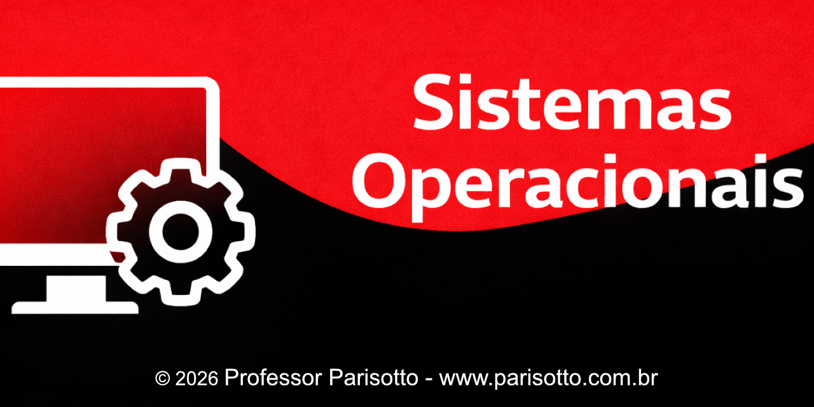
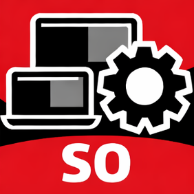

# 📘 Sistemas Operacionais

Repositório com os slides das aulas apresentados em sala.

---

## 📚 Conteúdo das aulas

### 🟢 Módulo 1 — Fundamentos

- [Aula 01 — Conceito de SO e Histórico](./a01-Conceito-Historico/slides.pdf)
- [Aula 02 — Conceito de SO e Histórico](./a02-Conceito-Historico/slides.pdf)
- [Aula 03 — Tipos e Estruturas de SO](./a03-Tipos-Estruturas-SO/slides.pdf)
- [Aula 04 — Chamadas e Interrupções do SO](./a04-Chamada-Interrupcao/slides.pdf)
- [Aula 05 — Processos](./a05-Processos/slides.pdf)
---

## 📌 Como usar

- Clique na aula desejada
- O slide abrirá direto no navegador
- Você também pode baixar o PDF

---

## ⚠️ Observações

- Este material é de apoio às aulas
- Os exemplos e explicações completas são apresentados em sala

---

## 👨‍🏫 Professor Parisotto

Material desenvolvido para uso em aula.
